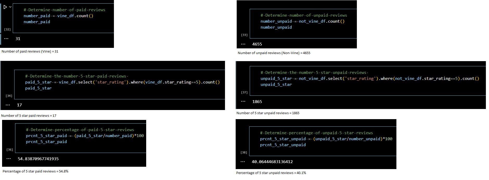

# Amazon Vine Analysis
## Overview
The purpose of this analysis was to determine if there is a bias in 5-star reviews for major appliances purchased from Amazon.
## Results
The data was first filtered to ensure viable results. Actions taken were as follows:
- The data was filtered for reviews with greater than or equal to 20 votes
- The data was filtered for reviews with greater than or equal to 50% helpful votes
- The data was then separated into two data sets
    - Paid reviews
    - Unpaid reviews

Three pieces of data were then determined for each of the final two data sets (Paid and UnPaid):
- How many reviews?
- How many reviews were 5 stars?
- What percentage of reviews were 5 stars?

Results are shown below via excerpts from the analysis program.

## Summary
Based upon the analysis resultant shown above, one could conclude that there is indeed a bias in the vine program towards 5-star reviews as a result of being paid. The percentage of unpaid 5-star reviews was 40.1% vs the percentage of paid reviews coming in at 54.8%

However, the sample size of paid reviews was only 31 reviews vs the sample size of unpaid reviews coming in at 4,655. It would be irresponsible to base any meaningful conclusion on such a disparity in sample sizes.

A recommendation for further analysis would be as follows:
- Instead of utilizing only 1 product line, combine multiple data sets in an effort to increase the data population thus increasing both sample sizes.
- Expand the range from only looking at 5-star reviews to 4 & 5 star reviews, essentially dividing the samples into more equitable buckets to see if the bias continues to exist.

